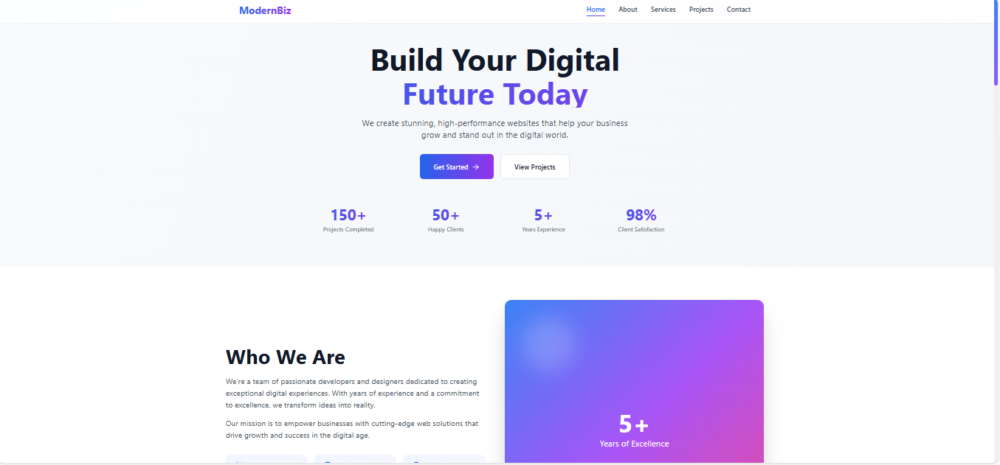
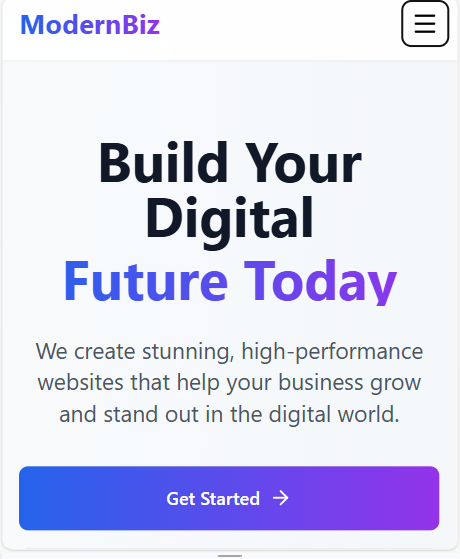

# 🚀 Modern Business Website

A modern, responsive business portfolio website built with React, Vite, and Tailwind CSS. Perfect for showcasing services, projects, and connecting with clients.


## ✨ Features

- 🎨 **Modern UI/UX** - Clean and professional design with smooth animations
- 📱 **Fully Responsive** - Works perfectly on all devices and screen sizes
- 🧩 **Reusable Components** - Well-structured and maintainable code
- 🎯 **Active Navigation** - Smart navigation with section detection
- 📋 **Contact Form** - Fully functional contact form with validation
- 🎨 **Project Portfolio** - Filterable project showcase with categories
- ⚡ **Fast Performance** - Optimized for speed and SEO
- 🌈 **Smooth Animations** - Elegant transitions and hover effects

## 🛠️ Tech Stack

- **Framework:** React 18.2
- **Build Tool:** Vite 5.0
- **Styling:** Tailwind CSS 3.4
- **Icons:** Lucide React
- **Animations:** CSS Animations + Tailwind

## 📦 Installation

1. **Clone the repository**
   ```bash
   git clone https://github.com/YOUR_USERNAME/modern-business-website.git
   cd modern-business-website
   ```

2. **Install dependencies**
   ```bash
   npm install
   ```

3. **Start development server**
   ```bash
   npm run dev
   ```

4. **Open in browser**
   ```
   http://localhost:5173
   ```

## 🚀 Build for Production

```bash
# Build the project
npm run build

# Preview production build
npm run preview
```

## 📂 Project Structure

```
modern-business-website/
├── public/              # Static assets
├── src/
│   ├── components/      # React components
│   │   ├── Navbar.jsx
│   │   ├── Hero.jsx
│   │   ├── About.jsx
│   │   ├── Services.jsx
│   │   ├── Projects.jsx
│   │   ├── Contact.jsx
│   │   └── Footer.jsx
│   ├── App.jsx         # Main app component
│   ├── index.css       # Global styles
│   └── main.jsx        # Entry point
├── index.html
├── package.json
├── tailwind.config.js
├── vite.config.js
└── README.md
```

## 🎯 Components Overview

### Navbar
- Fixed navigation with smooth scroll
- Active section highlighting
- Responsive mobile menu

### Hero Section
- Eye-catching landing area
- Call-to-action buttons
- Key statistics display

### About Section
- Company information
- Feature highlights
- Animated cards

### Services
- 6 service offerings
- Icon-based cards
- Hover effects

### Projects
- Filterable portfolio (Web App, Website, UI/UX)
- Project cards with tags
- Demo and GitHub links

### Contact Form
- Full form validation
- Error handling
- Success/Error states
- Contact information display

### Footer
- Social media links
- Newsletter subscription
- Site navigation
- Company information

## 🎨 Customization

### Colors
Edit `tailwind.config.js` to change the color scheme:
```javascript
theme: {
  extend: {
    colors: {
      // Add your custom colors
    }
  }
}
```

### Content
Update content in each component file located in `src/components/`

## 📱 Responsive Breakpoints

- **Mobile:** < 768px
- **Tablet:** 768px - 1024px
- **Desktop:** > 1024px

## 🤝 Contributing

Contributions are welcome! Please feel free to submit a Pull Request.

1. Fork the project
2. Create your feature branch (`git checkout -b feature/AmazingFeature`)
3. Commit your changes (`git commit -m 'Add some AmazingFeature'`)
4. Push to the branch (`git push origin feature/AmazingFeature`)
5. Open a Pull Request

## 📝 License

This project is licensed under the MIT License - see the LICENSE file for details.

## 👤 Author

**Your Name**
- GitHub: [@Bo0ndo2](https://github.com/YOUR_USERNAME)

## 🌟 Show your support

Give a ⭐️ if you like this project!

## 📸 Screenshots

### Desktop View


### Mobile View


---

Made using React and Tailwind CSS
